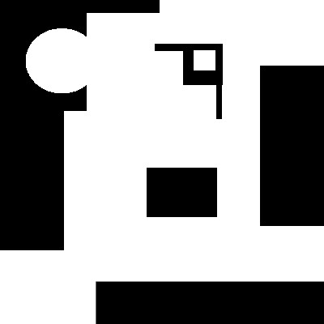
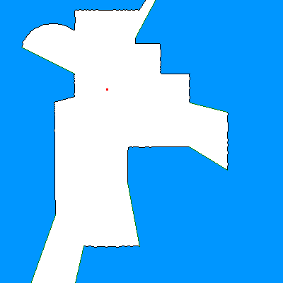
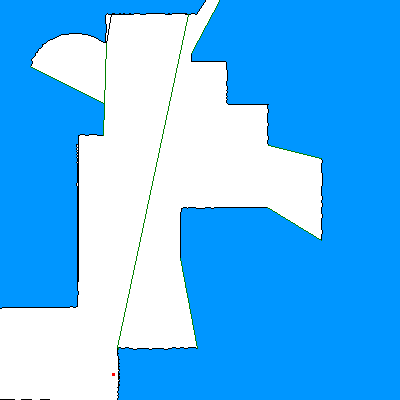
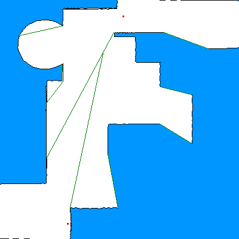
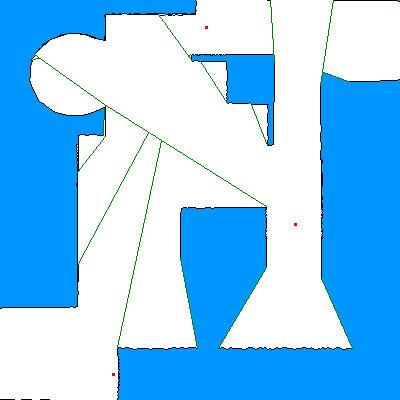
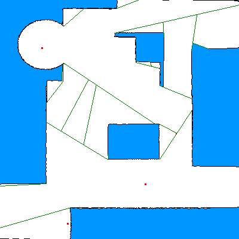

Essentialy implements a custom mid point boundary algorithm to make a map by 2D LiDAR (1 ray/degree) it with minimum number of scans. 

Uses ROS for some insane reason.

## Input Image

## Output: Step by step

